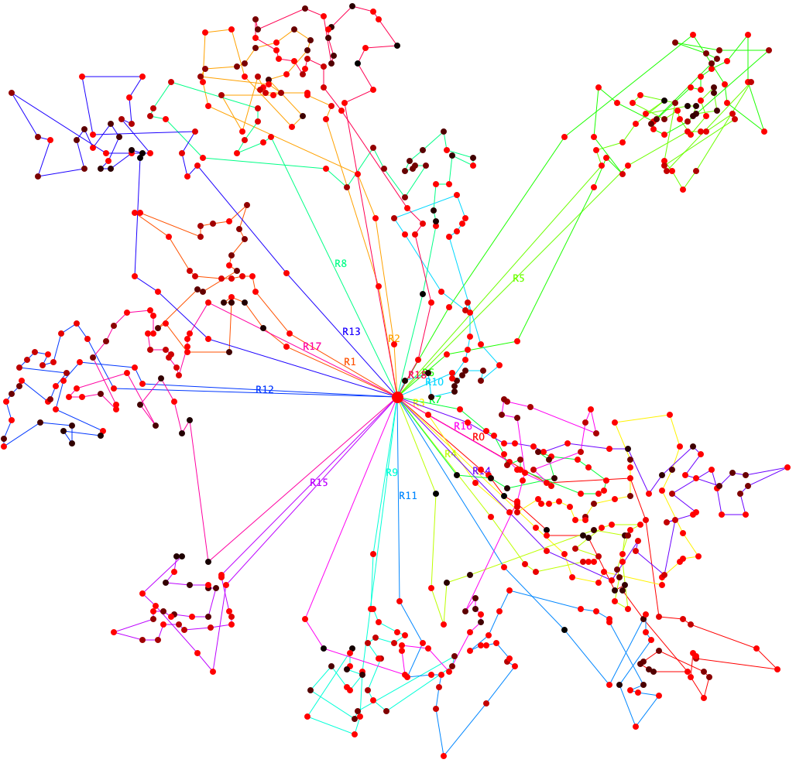
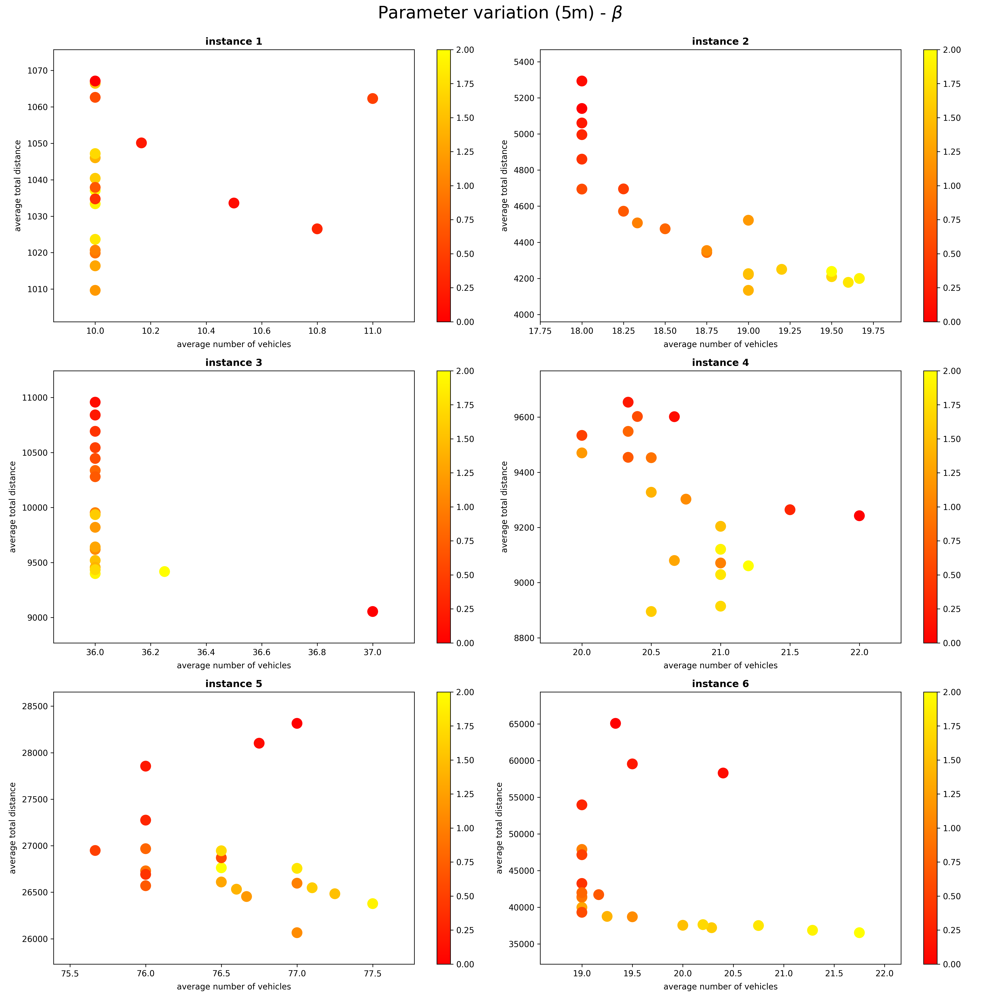

# Capacitated Vehicle Routing Problem with Time Windows (CVRPTW)

Project for course Heuristic Optimization Methods at Faculty of Electrical Engineering and Computing, University of
Zagreb.

### Project structure

Report: [PDF](HOM_2021_Project_report.pdf)  
Assignment: [PDF](HOM_2021_Project_assignment.pdf)

Best results: [best-export](src/main/resources/results/best-export)  
Plotted routes: [best-export-pics](src/main/resources/results/best-export-pics)  
Parameter analysis: [graph-rendered](src/main/resources/graph-rendered)

Source code: [kotlin](src/main/kotlin)  
Validators: [python](src/main/python)  
Problem instances: [resources](src/main/resources)  

### Best found solutions

| Instance | Vehicles | Distance |
|:--------:|:--------:|:--------:|
|    1     |    10    |  980.17  |
|    2     |    18    | 4233.05  |
|    3     |    36    | 8997.76  |
|    4     |    19    | 8878.73  |
|    5     |    74    | 26850.31 |
|    6     |    19    | 35656.83 |

### Best found solution for instance 4

### Example parameter analysis

